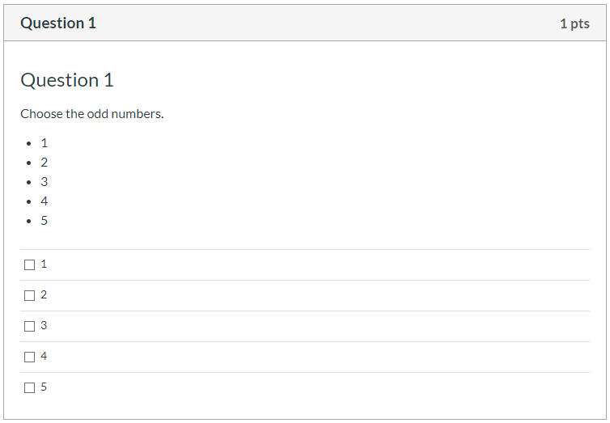
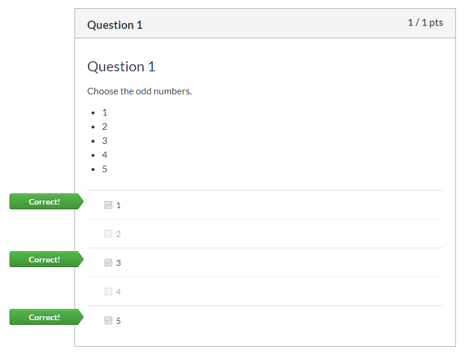
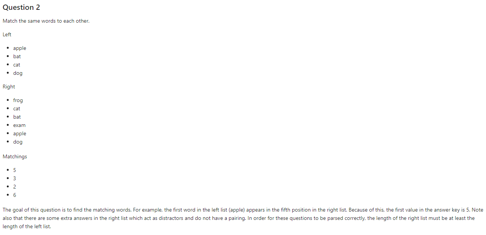
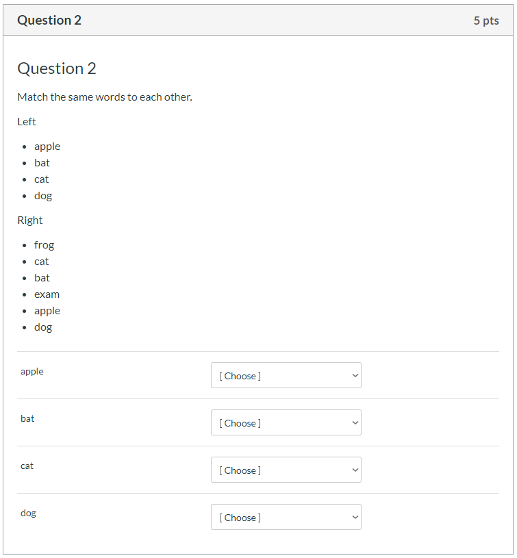
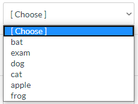
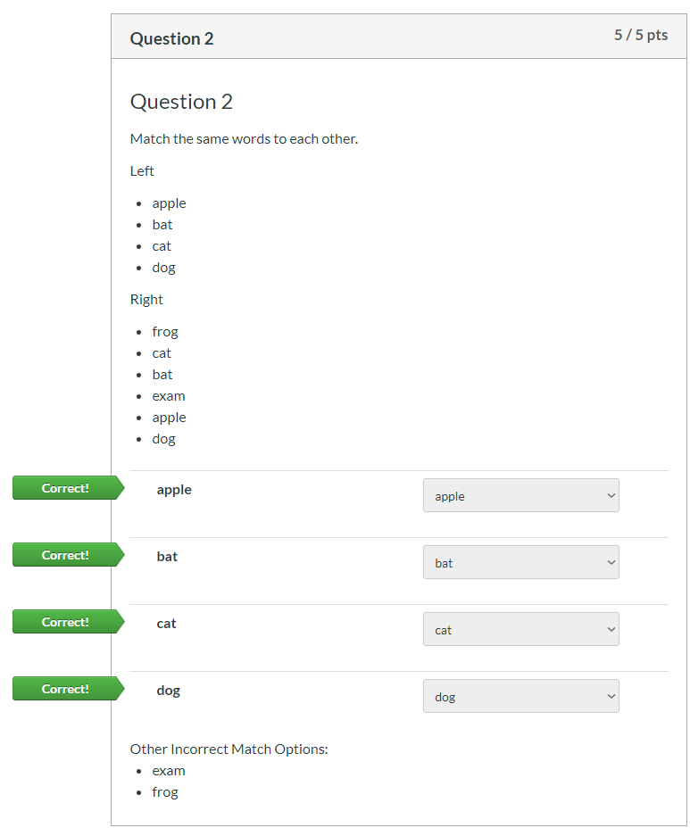
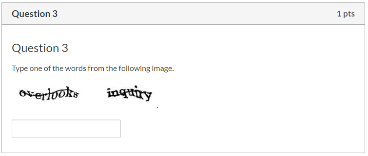
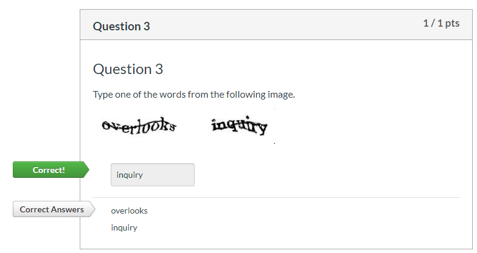
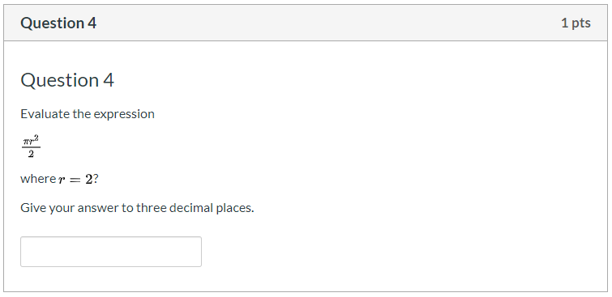
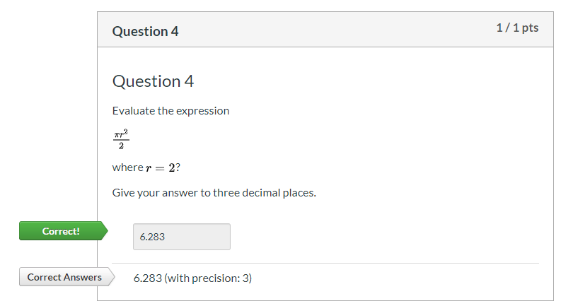

## Demonstration of md2canvas

### The Basic Commands

1. Install the package:

    ```
    pip install git+https://github.com/maracieco/md2canvas
    ```

2. Send a quiz to your canvas course:

    ```
    md2canvas examples/demo_quiz/DemoQuiz.md -t 11224~PLAy00HrlbYVp7a6DV0a6X7pGQ13uLukhxF4ouz3JUeDJR9dzY0hazkcDOlUuY0t -c 51824 -u https://canvas.ubc.ca 
    ```

    Note: this command won't actually work, you will need to generate your own token and use your own course ID

3. Strip the answers from your quiz so it can be distributed to students:

    ```
    anstrip examples/demo_quiz/DemoQuiz.md examples/demo_quiz/DemoQuizStripped.md
    ```

### Quiz Details

1. md2canvas uses the cells and their metadata to parse the questions with their answers and send them to Canvas

2. Here is a simple example question in its pure markdown form:

    ```
    +++ {"ctype": "question", "quesnum": 2, "question_type": "matching_question", "points_possible": 5}

    ### Question 2
    Match the same words to each other.

    Left

    * apple
    * bat
    * cat
    * dog

    Right

    * frog
    * cat
    * bat
    * exam
    * apple
    * dog

    +++ {"ctype": "answer", "quesnum": 2}

    Matchings

    * 5
    * 3
    * 2
    * 6

    +++ {"ctype": "answer", "quesnum": 2}

    The goal of this question is to find the matching words. For example, the first word in the left list (apple) appears in the fifth position in the right list. Because of this, the first value in the answer key is 5. Note also that there are some extra answers in the right list which act as distractors and do not have a pairing. In order for these questions to be parsed correctly, the length of the right list must be at least the length of the left list.
    ```

    And here is a screenshot of it in a Jupyter Notebook:

    
    
    In general, there will be one question cell that contains all the info necessary to understand and solve the question. It will be followed by some answer cells. The first one will be parsed for answer data and must follow specific formatting. The following cells can be anything, so they can be used as descriptions of the answers or code cells for computation or anything really. All of these cells will be stripped by anstrip as long as they are tagged as answer cells in the metadata.

    When this question is part of a quiz that is pushed to Canvas, it looks like this for the student during the quiz:

    

    And like this once the quiz has been graded:

    


3. Here is another example that is a matching question, notice that it sets an extra field in the metadata (points_possible) that changes the number of points the question is worth:
    ```
    +++ {"ctype": "question", "quesnum": 2, "question_type": "matching_question", "points_possible": 5}

    ### Question 2
    Match the same words to each other.

    Left

    * apple
    * bat
    * cat
    * dog

    Right

    * frog
    * cat
    * bat
    * exam
    * apple
    * dog

    +++ {"ctype": "answer", "quesnum": 2}

    Matchings

    * 5
    * 3
    * 2
    * 6

    +++ {"ctype": "answer", "quesnum": 2}

    The goal of this question is to find the matching words. For example, the first word in the left list (apple) appears in the fifth position in the right list. Because of this, the first value in the answer key is 5. Note also that there are some extra answers in the right list which act as distractors and do not have a pairing. In order for these questions to be parsed correctly, the length of the right list must be at least the length of the left list.
    ```
    
    
    
    

4. This is a simpler type of question called a short answer question:
    ```
    +++ {"ctype": "question", "quesnum": 3, "question_type": "short_answer_question"}

    ### Question 3
    Type one of the words from the following image.

    

    +++ {"ctype": "answer", "quesnum": 3}

    Answers
    * overlooks
    * inquiry

    +++ {"ctype": "answer", "quesnum": 3}

    The image included in this question is automatically updloaded to Canvas when md2canvas is run. This means that if you can see it when you preview the markdown or Jupyter Notebook, you will see it on Canvas as well.

    +++ {"ctype": "question", "quesnum": 4, "question_type": "numerical_question"}
    ```
    
    
    

5. Finally, this question shows off LaTeX:
    ~~~
    +++ {"ctype": "question", "quesnum": 4, "question_type": "numerical_question"}

    ### Question 4
    Evaluate the expression $$\frac{\pi r^2}{2}$$ where $r = 2$?

    Give your answer to three decimal places.

    +++ {"ctype": "answer", "quesnum": 4}

    * 6.283, 3: precision_answer

    +++ {"ctype": "answer", "quesnum": 4}

    Check this with python:

    ```{code-cell} ipython3
    :ctype: answer
    :quesnum: 4

    import math
    r = 2
    ans = math.pi * r ** 2 / 2
    print(f"{ans:.3f}")
    np.testing.assert_almost_equal(ans,6.383,decimals=3)
    ```
    ~~~
    
    
    

    In the future, we envision that md2canvas will be able to compute the answers just based off the code cells.

6. Other question types also exist. There are examples of all of them in md2canvas/examples/sample_quiz/SampleQuiz.md.